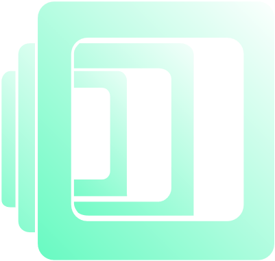

# GeoPortfolio
    

 

## Overview
Responsive design portfolio site built with Ruby on Rails. Leverages the Google Places and IPLocate APIs, as well as the Geocoder and Faker gems. WCAG 2 conformant.

## 📝 Usage

<!--  -->

## 💎 Gems

### Geolocation
* [Geocoder](https://github.com/alexreisner/geocoder)

### IP Propagation
* [Faker](https://github.com/faker-ruby/faker#fakerinternet)

### JSON ?
* [Jbuilder](https://github.com/rails/jbuilder)

### Styling
* [sass-rails](https://github.com/rails/sass-rails)
* [Devicon](https://github.com/devicons/devicon)
* [RailsRealFavicon](https://github.com/RealFaviconGenerator/rails_real_favicon)
* [animate.css-rails](https://github.com/TrevorS/animate.css-rails)

## ⚓ APIs
* [Google Places](https://developers.google.com/maps/documentation/places/web-service/overview)
* [IPLocate](https://www.iplocate.io/)

## ⚖️ License

